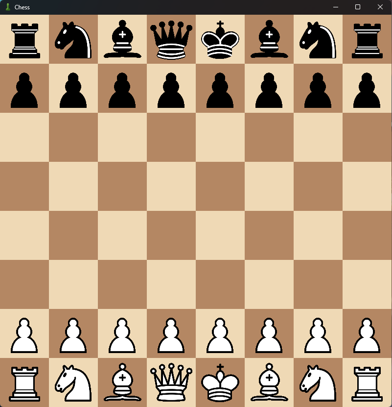
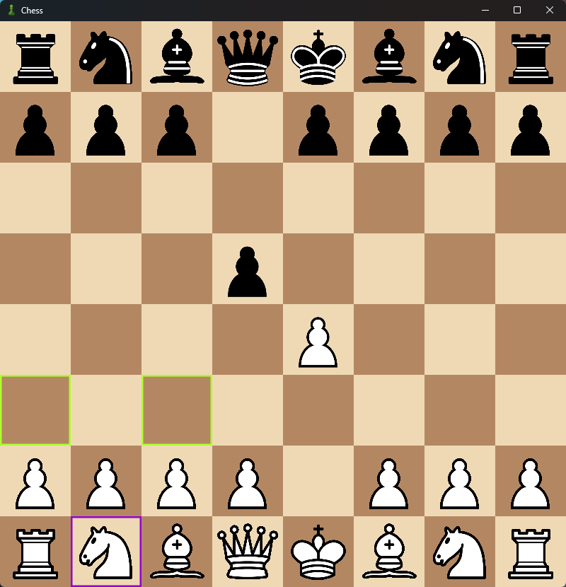

# Chess

A JavaFX chess application with an engine built with Java and Gradle.
The engine elo is estimated at about 900-1100 elo.
Assets are from [chess.com](https://chess.com)

Images:




## Requirements

* Windows, Linux, or macOS
* Java 25 [installable here](https://www.oracle.com/fr/java/technologies/downloads/#jdk26-windows)
* Internet connection for the first Gradle build

You **do not need to install Gradle manually**. The project includes the Gradle Wrapper.

## Running the Project

Clone the repository:

```bash
git clone https://github.com/ugo635/Chess.git
cd Chess
```

Then run the application with Gradle:

### Windows

```bat
gradlew.bat run
```

### Linux / macOS

```bash
./gradlew run
```

Gradle will automatically download the required dependencies.

## Creating a Windows Portable Application

The project includes a Gradle task for creating a self-contained Windows application.

Run:

```bat
gradlew.bat packageExeInstantOpen
```

This task creates a Windows application image containing everything required to run the game.

The generated application can be copied to another Windows computer and run without installing Java separately.

### Using the Build Script

For convenience, you can also use:

```text
build-windows-portable.bat
```

Simply double-click the file or run it from a terminal.

It will execute:

```bat
gradlew.bat packageExeInstantOpen
```

You do not need to install Gradle manually because the Gradle Wrapper is included in the repository.

> A JDK with `jpackage` must be installed on the computer used to create the build. (installed by default with the JDK)

## Project Structure

```text
Chess/
├── gradle/
├── src/
│   └── main/
│       ├── java/
│       └── resources/
├── build.gradle
├── settings.gradle
├── gradlew
├── gradlew.bat
└── build-windows-portable.bat
```

## Development

The project uses:

* **Java**
* **JavaFX**
* **Gradle**

The main application class is:

```text
com.me.chess.Main
```

## Useful Gradle Commands

| Command                         | Description                    |
| ------------------------------- |--------------------------------|
| `gradlew run`                   | Run the application            |
| `gradlew clean`                 | Remove build files             |
| `gradlew packageExeInstantOpen` | Create the Windows application |

On Windows, use `gradlew.bat` instead of `gradlew` when necessary.

## Troubleshooting

### `java` is not recognized

Install Java 25 [installable here](https://www.oracle.com/fr/java/technologies/downloads/#jdk26-windows) and make sure Java is available in your `PATH`.

Verify it with:

```bat
java --version
```

### `jpackage` is not recognized

`jpackage` is included with the JDK. Make sure a JDK is installed rather than only a JRE.

Verify it with:

```bat
jpackage --version
```

### Gradle cannot download dependencies

Make sure you have an active internet connection and try running the command again.
